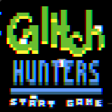
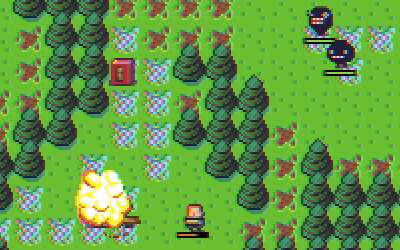

# glitch-hunters
> an entry for js13k.  
> [![js13k][js13k-image]][js13k-url]

Glitchmonsters are trying to take over the world!
Shoot them!




## setup
```bash
npm install   # install dependencies
./grunt       # or `grunt` to see if dev env works / builds
./grunt asset # regenerate img.js if new asset in img/
./server.js   # execute simple static server
```

## folders
- `src` all source/image should be here
- `build` target dir when building
- `dist` exported .zip file for the competition

## dev
`./grunt dev` to execute jshint/tests automatically on file write in `src`

[js13k-image]: http://js13kgames.com/img/js13kgames.png
[js13k-url]: http://js13kgames.com
